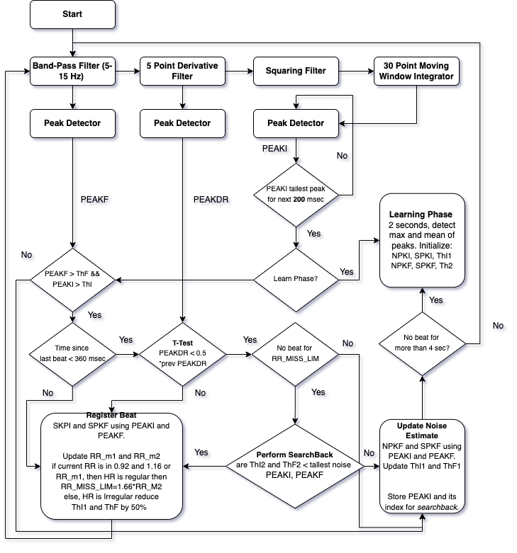

# Fixed Point Implementation of Pan‑Tompkins ECG QRS Detector

## Summary

This repository contains a fixed‑point, MCU‑friendly implementation of the classic Pan & Tompkins QRS detector.

It efficiently detects R‑peaks in ECG signals using only integer arithmetic, making it suitable for embedded systems and FPGAs.

The code includes corrected filter stages (based on published errata) and optimized bit‑shift operations to eliminate expensive multiplications/divisions.

A full sample‑by‑sample implementation is provided along with a debug‑friendly command‑line tool.

## Background and Algorithm

Pan & Tompkins (1985) proposed a real‑time ECG beat detection method that has since become a standard in biomedical devices.

The algorithm processes the signal through:

- Bandpass filtering
- Derivative operation
- Squaring
- Moving‑window integration (MVA)
- Adaptive thresholds (ThI1, ThI2)
- Decision logic + search‑back rules

The following diagram summarizes the algorithm:


## Implementation

The detector is implemented in:

- `PanTompkins.c` / `PanTompkins.h` — the full fixed‑point algorithm
- `PanTompkinsCMD.c` — example command‑line usage
- `pan_main.c` — our enhanced feature‑extraction wrapper, updated to:
  - Load cleaned CSV ECG signals
  - Process them sample‑by‑sample
  - Detect peaks
  - Compute HRV features
  - Compute QRS width (using MVA + ThI1/2)
  - Compute SQI
  - Append all features into a single CSV: `features_ecg/all_ecg_features.csv`
  - Debug values (MVA, ThI1) can also be collected per sample for plotting.

An example output of the original code is shown below:

## Feature Extraction

Our updated `pan_main.c` generates one consolidated file:
```
features_ecg/all_ecg_features.csv
```

Each row corresponds to a record and contains:

- `record`
- `n_beats`
- `RR_mean_ms`
- `RR_median_ms`
- `RR_min_ms`
- `RR_max_ms`
- `SDNN_ms`
- `RMSSD_ms`
- `CVRR_q10` (scaled by ×1024)
- `HR_bpm`
- `mean_QRS_ms`
- `SQI_q10` (scaled by ×1024)

The program extracts the record name automatically from filenames like:
```
100_clean.csv → record = "100"
```

All rows are appended safely; the header is written only once.

## Usage

### Build
```bash
gcc -O3 pan_main.c PanTompkins.c -o pan_det
```

### Run for a single file
```bash
./pan_det ../cleaned_ecg/100_clean.csv 360
```

This automatically creates:
```
features_ecg/all_ecg_features.csv
```

and appends a row for record 100.

### Batch processing

Use the included script:
```bash
python3 run_all.py
```

which runs `pan_det` on all cleaned ECGs in:
```
../cleaned_ecg/
```

## Getting Started (Core API)

Include the header:
```c
#include "PanTompkins.h"
```

Initialize:
```c
PT_init();
```

Call per sample:
```c
int16_t delay = PT_StateMachine(new_sample);
```

If `delay > 0`, an R‑peak was detected at:
```c
index = current_sample_index - delay;
```

Debug values:
```c
PT_get_MVFilter_output()
PT_get_ThI1_output()
```

## References

[1] J. Pan and W. J. Tompkins, *Real‑Time QRS Detection Algorithm*, IEEE BME, 1985

[2] P. Hamilton & W. Tompkins, *Investigation of QRS Detection Rules*, IEEE BME, 1986
